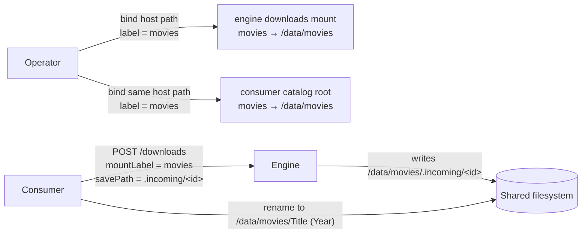

# Downloads Mounts and Zero-Copy Hand-off

Status: Implemented
Created: 2026-07-03
Updated: 2026-07-03

## Description

A consumer downloads with this engine so it can then **move** the finished files
into its own library. That move must be a same-filesystem rename (zero-copy), not a
cross-container byte copy — which means the engine has to write onto a filesystem
the consumer can move from in place. This doc covers how downloads are routed to the
right filesystem via labelled mounts, and how `savePath` resolution is kept safe
(`Torrents/TorrentEngineSettings.cs`).

The engine stays ignorant of the consumer's catalogs: it is told only a
`mountLabel` + a relative staging `savePath` and resolves them against its own
labelled downloads root.

## The mount-label contract

The `downloads` external mount is declared `multiple` in the manifest, so the
operator binds **one host path per catalog filesystem**. Hosty has no cross-app
mount sharing — each app configures its mounts independently — so the **label** is
the only key shared between the engine and its consumer:

- The operator binds each host path into the engine's `downloads` mount with the
  **same label** the consumer uses for the matching catalog root.
- The consumer sends that label as `mountLabel` on `POST /downloads`.
- The engine resolves the relative `savePath` against the root registered under that
  label, keeping the download — and therefore the consumer's post-download move — on
  one filesystem.

## Label resolution and injection

Core injects the mounts as `HOSTY_MOUNT_DOWNLOADS`: a comma-joined list of
`label=path` entries (container paths under docker). `ParseDownloadsRoots` turns
this into a case-insensitive `label → absolute root` map:

- Each entry is split on the **first** `=` only (a host path may itself contain
  `=`).
- An entry with no `=` (an older Core that injected bare paths), or a blank explicit
  label, falls back to the path's base name as its label.
- An entry that still has no usable label (e.g. a bare filesystem root) is **skipped**
  rather than stored under an unreachable empty key.
- With **no** mount injected (a standalone / dev run), a single unlabeled fallback
  root is used at `{HOSTY_APP_DATA_DIR}/downloads`, so the engine still runs.

`ResolveSaveDirectory(mountLabel, savePath)` then picks the root:

- **Label given** → the matching root, or an `ArgumentException` (a `400` at the
  API) naming the configured labels if it is unknown — so a download is never
  written to the wrong filesystem, and the operator gets an actionable message.
- **No label** → allowed only when there is exactly **one** root (a single mount, or
  the standalone fallback). With several roots, a missing label is a `400` (it would
  be ambiguous which filesystem to write to).

## `savePath` traversal safety

Once a root is chosen, `savePath` is resolved against it and **guaranteed to stay
inside** it. A relative path is combined with the root; an absolute path is taken
as-is; then the result must equal the root or start with `root +
DirectorySeparator`. Anything that escapes — `../..`, or an absolute path outside
the root — is rejected with an `ArgumentException` (a `400`). This prevents a
download from being written off-mount regardless of what the consumer sends. An
omitted `savePath` resolves to the mount root itself.

## Why this preserves zero-copy

The engine writes payload under `<mount-root>/<savePath>` — for Media Server,
`<catalog.root>/.incoming/<downloadId>/…`. Because the operator bound the **same
host path** into both apps, that directory is on the same filesystem the consumer's
catalog lives on, so the consumer's move from `.incoming/` into its canonical
library is an atomic same-filesystem rename with no copy. An unknown label failing
loudly (`400`) rather than silently landing on the wrong mount is what keeps this
guarantee honest.

## Testing Expectations

Backend tests use xUnit and Imposter. Required coverage
(`TorrentEngineSettingsTests`):

- `ParseDownloadsRoots`: `label=path` parsing, first-`=` split, base-name fallback
  for unlabeled entries, skipping unusable entries, case-insensitive lookup, and the
  standalone single-fallback-root case.
- `ResolveSaveDirectory`: single-root label-optional, multi-root label-required,
  unknown label → error listing configured labels, relative path joined under the
  root, absolute/`..` traversal outside the root rejected, empty `savePath` → root.
