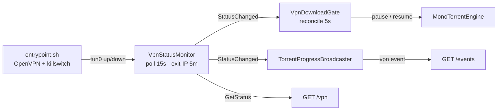

# VPN Isolation and Killswitch

Status: Implemented
Created: 2026-07-03
Updated: 2026-07-03

## Description

VPN isolation is the reason this engine is a separate app. Peer traffic must egress
**only** through an OpenVPN tunnel, while the control API stays reachable on the
docker bridge for the consumer. Two layers cooperate: a container entrypoint
(`docker/entrypoint.sh`) that brings up the tunnel behind a default-deny iptables
**killswitch** before the API starts, and two in-process background services
(`Vpn/VpnStatusMonitor.cs`, `Vpn/VpnDownloadGate.cs`) that report tunnel status and
pause/resume downloads around outages.

The operator supplies their own VPN — the engine bundles none. Running OpenVPN and
rewriting iptables inside the container requires `NET_ADMIN` and `/dev/net/tun`,
granted through the [manifest](hosty-runtime-app.md).

> **First cut — leak-test before trusting it.** The killswitch rules are a first
> implementation and must be validated in a real VPN environment (kill the tunnel;
> confirm no peer traffic egresses the bridge) before use where a leak matters. See
> [Open questions](#open-questions).

## Container startup (`docker/entrypoint.sh`)

The entrypoint runs as PID 1 up to the final `exec`, in this order:

1. **Materialize the `.ovpn`.** `OPENVPN_CONFIG` is a Hosty secret setting. A
   single-line secret field mangles the newlines OpenVPN needs, so the config may be
   the **raw** `.ovpn` **or a base64 encoding** of it. The script tries a
   whitespace-stripped base64 decode and accepts it only if the result looks like an
   OpenVPN config (`client` / `remote` / `proto` / `dev` line); otherwise it treats
   the value as raw. CRLF is stripped so `remote` parsing doesn't carry a trailing
   `\r`. If `OPENVPN_USERNAME` is set, an `--auth-user-pass` file is written.
2. **Apply the killswitch** (see below) — **before** OpenVPN starts, so there is no
   window where traffic can leak. This also resolves the VPN `remote`(s) and the
   telemetry collector once, **pinning** each into `/etc/hosts` while docker's DNS is
   still reachable, so later lookups survive the resolv.conf rewrite below.
3. **Start OpenVPN** as a daemon (`--writepid`, `--log /var/log/openvpn.log`); its
   log is also mirrored to stdout so it shows up in `docker logs`.
4. **Wait for the tunnel** — up to 60s for `tun0` to appear; logs and continues (the
   killswitch keeps traffic contained even if it doesn't come up in time).
5. **Route DNS through the tunnel.** Once `redirect-gateway` sends traffic over
   `tun0`, the host/docker resolver becomes unreachable and using it would leak
   lookups outside the VPN. `resolv.conf` is rewritten to a tunnel-reachable
   resolver (`VPN_DNS`, default `1.1.1.1`). The `remote`/collector hosts pinned in
   step 2 still resolve because they now come from `/etc/hosts`, not DNS.
6. **Start a watchdog** — a background loop that every 10s checks whether the
   `openvpn` process is alive (by name, robust to a stale PID file) and restarts it
   if it died, so the tunnel — the killswitch's only egress path — comes back
   without a container restart. OpenVPN's own keepalive/ping-restart handles
   ordinary network drops.
7. **`exec` the API** so `TorrentEngine.Api` becomes PID 1 and receives signals for
   a clean shutdown.

## The killswitch (iptables)

`apply_killswitch` sets a default-deny policy and opens only what is required:

- **Default `DROP`** on `INPUT`, `OUTPUT`, and `FORWARD` — nothing flows unless a
  rule below allows it.
- **Loopback** in/out (includes docker's embedded DNS at `127.0.0.11`).
- **Established/related** conntrack in both directions.
- **Control API in** — new TCP connections **from the docker subnet** to the
  in-container control port only. The port is read from `ASPNETCORE_URLS` (the
  container's own listen port), **not** the host-published port, so the killswitch
  opens the port the API actually binds.
- **Tunnel** — everything in/out over `tun0`.
- **VPN endpoint** — the `remote <host> [port] [proto]` lines from the `.ovpn` are
  parsed (default `udp` / `1194`; a `proto` of `tcp-client`/`udp4`/… is mapped to the
  `tcp`/`udp` iptables understands), the hostnames resolved and pinned, and outbound
  to those IP/port/proto allowed on the bridge — just enough for OpenVPN to establish
  the tunnel.
- **Telemetry collector** — when `OTEL_EXPORTER_OTLP_ENDPOINT` is injected, its host
  (typically `host.docker.internal`, reachable only on the bridge) is pinned, given a
  `/32` route so it keeps using the bridge after `redirect-gateway`, and allowed
  outbound on the bridge. Without this the killswitch would silently drop every export
  (see [Observability egress](#observability-egress)).

The **IPv4** rules above are mirrored by an **IPv6** default-deny (`ip6tables`):
loopback, established/related, and `tun0` are allowed and everything else is dropped.
The engine binds IPv4-only (it doesn't solicit v6 peers/DHT), so this is belt-and-
suspenders against stray v6 leaking around the (IPv4) tunnel on an IPv6-enabled docker
network. It is skipped when the container has no IPv6 stack (nothing to leak).

The net effect: the consumer can reach the control API on the bridge, OpenVPN can
reach its server on the bridge, the telemetry collector is reachable on the bridge,
and **all other egress** (every peer connection, DNS, the exit-IP check) can leave
only through `tun0`. If the tunnel is down, that traffic is dropped rather than
falling back to the direct connection.

### Observability egress

The engine's OTLP exporter only wires up when Core injects `OTEL_EXPORTER_OTLP_ENDPOINT`
(docker runtime + observability enabled). That collector lives on the docker host, not
past the tunnel, and two things would otherwise make exports vanish: the killswitch drops
the new bridge connection, and the resolv.conf rewrite makes `host.docker.internal`
unresolvable. The entrypoint's collector allowance (pin + `/32` bridge route + `iptables`
accept) is what lets telemetry actually leave. It is a first cut and, like the killswitch,
should be validated against a real collector before relying on it.

## VPN status monitor (`Vpn/VpnStatusMonitor.cs`)

A `BackgroundService` that tracks the tunnel and exposes it to `GET /vpn` and the
SSE `vpn` event. It reports a `VpnStatus`
(`{ connected, tunnelInterface, tunnelAddress, exitIp, exitCountry, checkedAt }`):

- **Tunnel read (cheap, local).** `connected` means the interface named by
  `VPN_INTERFACE` (default `tun0`) exists with an assigned IPv4 address — tun
  devices often report `OperationalStatus.Unknown`, so an assigned address is the
  reliable "up" signal. Polled every **15s**.
- **Exit-IP check (best-effort, over the tunnel).** An outbound request to
  `VPN_EXIT_IP_CHECK_URL` (default `https://ipinfo.io/json`) proves traffic actually
  egresses the VPN and reports `exitIp` / `exitCountry`. Refreshed on connect and
  then at most every **5 minutes**; a failed check still stamps its timestamp so a
  failure backs off for the full interval instead of hammering the service. It
  parses ipinfo/ip-api JSON shapes or a bare-IP body, with an 8s timeout. Disable it
  with `VPN_EXIT_IP_CHECK=false`, or point it elsewhere with `VPN_EXIT_IP_CHECK_URL`.
- **`GetStatus()`** re-reads the tunnel live and combines it with the **cached**
  exit IP, reporting the last poll's `checkedAt` (so the timestamp never implies the
  exit IP was just re-verified). This is what `GET /vpn` serves without waiting on
  the loop.
- **`StatusChanged`** fires only when connectivity, the tunnel address, or the exit
  IP/country meaningfully changes — that is what becomes an SSE `vpn` event.

Because the exit-IP check goes out over the tunnel, it is naturally blocked by the
killswitch when the tunnel is down; a failure there is expected and non-fatal since
the tunnel read already covers connectivity.

## VPN download gate (`Vpn/VpnDownloadGate.cs`)

A `BackgroundService` that keeps downloads from churning against a dead tunnel and
surfaces a clean "paused — VPN down" state instead of a silent "downloading at
0 B/s". It reconciles every **5s** (a tick, not just on the status-change event, so
torrents added *during* an outage are handled too):

- **Tunnel down** → pause every active torrent (anything not already
  Paused/Stopped/Stopping/Error), recording each hash it paused.
- **Tunnel restored** → resume **only** the torrents this gate paused, and only if
  they are still in the `Paused` state it left them in — so it never overrides a
  user pause/stop/remove made during the outage. A torrent removed mid-outage
  resumes to a no-op.

The killswitch already blocks the traffic; the gate is about state hygiene and not
spinning on connections that cannot leave.

## Status flow end to end

A consumer seeds status on connect with `GET /vpn`, then receives `vpn` SSE events
as it changes; it can also gate its own readiness on `connected` while the tunnel
comes up (see [Consumer integration](consumer-integration.md)).

## Open questions

- **Killswitch hardening.** The iptables/ip6tables rules are a first cut and need leak
  tests on tunnel drop in a real VPN environment before privacy-sensitive use.
- **Killswitch scope.** IPv6 is now default-denied and the engine binds IPv4-only, so
  v6 no longer leaks around the tunnel. Still assumed: a single default-route bridge
  interface, and an **IPv4** `remote` endpoint (a v6-only `remote` is not reachable
  under the v6 default-deny — allow it explicitly if needed). Multi-homed setups are
  not covered.
- **Reconnect DNS.** The VPN `remote` is pinned into `/etc/hosts` at boot so an OpenVPN
  reconnect (with the tunnel — and thus its DNS — down) still resolves it. A `remote`
  whose IP changes while the tunnel is down would still need a container restart.
- **Telemetry egress.** The collector allowance is best-effort and depends on the
  collector being reachable via the original bridge gateway; validate exports actually
  arrive when enabling observability.

## Testing Expectations

The tunnel/killswitch behavior depends on real container capabilities
(`NET_ADMIN`, `/dev/net/tun`) and is validated at the runtime level (leak tests),
not by unit tests. Unit-testable pieces, with xUnit and Imposter:

- `VpnStatus` shape and the monitor's change-detection predicate (what counts as a
  meaningful change).
- The exit-IP body parsing (ipinfo JSON, ip-api JSON, bare-IP text, and garbage →
  nulls).
- `VpnDownloadGate` reconcile logic: pauses active torrents when down, resumes only
  its own paused set when restored, respects a concurrent user pause/stop/remove.
