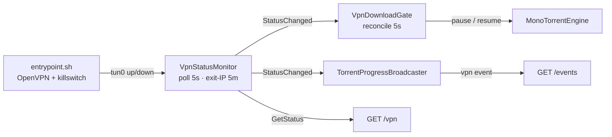

# VPN Isolation and Killswitch

Created: 2026-07-03
Updated: 2026-09-03

## Description

VPN isolation is the reason this engine is a separate app. Peer traffic must egress
**only** through an OpenVPN tunnel, while the control API stays reachable on the
docker bridge for the consumer. Two layers cooperate: a container entrypoint
(`docker/entrypoint.sh`) that brings up the tunnel — from one of the operator's
OpenVPN profiles, see [VPN profiles](../vpn-profiles/feature.md) — behind a
default-deny iptables **killswitch** before the API starts, and two in-process
background services
(`Vpn/VpnStatusMonitor.cs`, `Vpn/VpnDownloadGate.cs`) that report tunnel status and
pause/resume downloads around outages.

The operator supplies their own VPN — the engine bundles none. Running OpenVPN and
rewriting iptables inside the container requires `NET_ADMIN` and `/dev/net/tun`,
granted through the [manifest](../hosty-runtime-app/feature.md).

> **Not yet leak-tested.** The killswitch rules are a first implementation, verified
> by reading them rather than by observing traffic on a tunnel drop. Treat them as
> unproven where a leak matters. The validation work is tracked in [plan.md](plan.md).

## Container startup (`docker/entrypoint.sh`)

The entrypoint runs as PID 1 up to the final `exec`, in this order:

1. **Resolve the active profile.** The `.ovpn` files are the operator's own, in
   the read-only `vpn` mount (`HOSTY_MOUNT_VPN`). The entrypoint lists them, picks
   the active one (persisted selection → `VPN_PROFILE` → the only one → the first by
   name) and publishes its view in the supervisor status file. Folder layout, ids,
   credentials and the precedence rule: [VPN profiles](../vpn-profiles/feature.md).
2. **Apply the killswitch** (see below) — **before** OpenVPN starts, so there is no
   window where traffic can leak. This also resolves the `remote`(s) of **every**
   profile and the telemetry collector once, **pinning** each into `/etc/hosts` while
   docker's DNS is still reachable, so later lookups — and a later profile switch —
   survive the resolv.conf rewrite below.
3. **Start OpenVPN** for the active profile, in place from the folder (`--cd`, plus
   `--auth-user-pass` from its `<id>.auth` when present) as a daemon (`--writepid`,
   `--log /var/log/openvpn.log`); its log is also mirrored to stdout so it shows up
   in `docker logs`. With no profile to start, nothing does: the killswitch stays
   up and the API reports why.
4. **Wait for the tunnel** — up to 60s for the tunnel interface (`VPN_INTERFACE`,
   default `tun0`) to appear; logs and continues (the killswitch keeps traffic
   contained even if it doesn't come up in time).
5. **Route DNS through the tunnel.** Once `redirect-gateway` sends traffic over
   `tun0`, the host/docker resolver becomes unreachable and using it would leak
   lookups outside the VPN. `resolv.conf` is rewritten to a tunnel-reachable
   resolver (`VPN_DNS`, default `1.1.1.1`). The `remote`/collector hosts pinned in
   step 2 still resolve because they now come from `/etc/hosts`, not DNS.
6. **Start the supervisor** — one background loop that owns the OpenVPN process.
   Every 2s it re-reads the profile selection file and performs a switch when it
   names another profile ([VPN profiles](../vpn-profiles/feature.md#switching-at-runtime));
   every 10s it restarts the `openvpn` process if it died (checked by name, robust
   to a stale PID file), so the tunnel — the killswitch's only egress path — comes
   back without a container restart. OpenVPN's own keepalive/ping-restart handles
   ordinary network drops.
7. **`exec` the API** so `TorrentEngine.Api` becomes PID 1 and receives signals for
   a clean shutdown.

## The killswitch (iptables)

`apply_killswitch` sets a default-deny policy and opens only what is required:

- **Default `DROP`** on `INPUT`, `OUTPUT`, and `FORWARD` — nothing flows unless a
  rule below allows it.
- **Loopback** in/out (includes docker's embedded DNS at `127.0.0.11`).
- **Established/related** conntrack in both directions.
- **Control API in** — new TCP connections **from the docker subnet** to the
  in-container control port only. The port is read from `ASPNETCORE_URLS` (the
  container's own listen port), **not** the host-published port, so the killswitch
  opens the port the API actually binds.
- **Tunnel** — everything in/out over the tunnel interface (`VPN_INTERFACE`, default `tun0`).
- **VPN endpoint** — the `remote <host> [port] [proto]` lines of the **active**
  profile are parsed (CR-stripped; default `udp` / `1194`; a `proto` of
  `tcp-client`/`udp4`/… is mapped to the `tcp`/`udp` iptables understands), the
  hostnames resolved (from `/etc/hosts`, where every profile's remotes were pinned
  at boot) and outbound to those IP/port/proto allowed on the bridge — just enough
  for OpenVPN to establish the tunnel. Only the active profile's endpoints are open;
  a profile switch re-applies the whole rule set keyed to the new one, and because
  the default `DROP` policies persist across the flush there is no leak window.
- **Telemetry collector** — when `OTEL_EXPORTER_OTLP_ENDPOINT` is injected, its host
  (typically `host.docker.internal`, reachable only on the bridge) is pinned, given a
  `/32` route so it keeps using the bridge after `redirect-gateway`, and allowed
  outbound on the bridge. Without this the killswitch would silently drop every export
  (see [Observability egress](#observability-egress)).

The **IPv4** rules above are mirrored by an **IPv6** default-deny (`ip6tables`):
loopback, established/related, and `tun0` are allowed and everything else is dropped.
The engine binds IPv4-only (it doesn't solicit v6 peers/DHT), so this is belt-and-
suspenders against stray v6 leaking around the (IPv4) tunnel on an IPv6-enabled docker
network. It is skipped when the container has no IPv6 stack (nothing to leak).

The net effect: the consumer can reach the control API on the bridge, OpenVPN can
reach its server on the bridge, the telemetry collector is reachable on the bridge,
and **all other egress** (every peer connection, DNS, the exit-IP check) can leave
only through `tun0`. If the tunnel is down, that traffic is dropped rather than
falling back to the direct connection.

### Observability egress

The engine's OTLP exporter only wires up when Core injects `OTEL_EXPORTER_OTLP_ENDPOINT`
(docker runtime + observability enabled). That collector lives on the docker host, not
past the tunnel, and two things would otherwise make exports vanish: the killswitch drops
the new bridge connection, and the resolv.conf rewrite makes `host.docker.internal`
unresolvable. The entrypoint's collector allowance (pin + `/32` bridge route + `iptables`
accept) is what lets telemetry actually leave. It is a first cut and, like the killswitch,
should be validated against a real collector before relying on it.

## VPN status monitor (`Vpn/VpnStatusMonitor.cs`)

A `BackgroundService` that tracks the tunnel and exposes it to `GET /vpn` and the
SSE `vpn` event. It reports a `VpnStatus`
(`{ connected, tunnelInterface, tunnelAddress, exitIp, exitCountry, checkedAt, profile, pendingProfile, lastError }`
— the last three are the entrypoint supervisor's view, read from its status file on
every poll and every `GET /vpn`; see [VPN profiles](../vpn-profiles/feature.md)):

- **Tunnel read (cheap, local).** `connected` means the interface named by
  `VPN_INTERFACE` (default `tun0`) exists with an assigned IPv4 address — tun
  devices often report `OperationalStatus.Unknown`, so an assigned address is the
  reliable "up" signal. Polled every **5s** together with the supervisor's status
  file — short so a profile switch (`pendingProfile`, then the new `profile`) is
  pushed while it happens.
- **Exit-IP check (best-effort, over the tunnel).** An outbound request to
  `VPN_EXIT_IP_CHECK_URL` (default `https://ipinfo.io/json`) proves traffic actually
  egresses the VPN and reports `exitIp` / `exitCountry`. Refreshed on connect,
  whenever the tunnel is a different one (a new tunnel address, or the supervisor
  running another profile — a switch can complete between two polls), and then at
  most every **5 minutes**; a failed check still stamps its timestamp so a
  failure backs off for the full interval instead of hammering the service. It
  parses ipinfo/ip-api JSON shapes or a bare-IP body, with an 8s timeout. Disable it
  with `VPN_EXIT_IP_CHECK=false`, or point it elsewhere with `VPN_EXIT_IP_CHECK_URL`.
- **`GetStatus()`** re-reads the tunnel and the supervisor status live and combines
  them with the **cached** exit IP, reporting the last poll's `checkedAt` (so the
  timestamp never implies the exit IP was just re-verified). The cached exit is used
  only while it still describes the current tunnel — same address, same profile —
  and is reported as unknown otherwise. This is what `GET /vpn` serves without
  waiting on the loop.
- **`StatusChanged`** fires only when connectivity, the tunnel address, the exit
  IP/country, or the supervisor's profile / pending profile / last error meaningfully
  changes — that is what becomes an SSE `vpn` event.

Because the exit-IP check goes out over the tunnel, it is naturally blocked by the
killswitch when the tunnel is down; a failure there is expected and non-fatal since
the tunnel read already covers connectivity.

## VPN download gate (`Vpn/VpnDownloadGate.cs`)

A `BackgroundService` that keeps downloads from churning against a dead tunnel and
surfaces a clean "paused — VPN down" state instead of a silent "downloading at
0 B/s". It reconciles every **5s** (a tick, not just on the status-change event, so
torrents added *during* an outage are handled too):

- **Tunnel down** → pause every active torrent (anything not already
  Paused/Stopped/Stopping/Error), recording each hash it paused.
- **Tunnel restored** → resume **only** the torrents this gate paused, and only if
  they are still in the `Paused` state it left them in — so it never overrides a
  user pause/stop/remove made during the outage. A torrent removed mid-outage
  resumes to a no-op.

A tick with **no torrents registered and none of this gate's own pauses outstanding**
returns before reading the tunnel: neither branch could act on anything, and
`GetStatus()` enumerates every network interface, so on an idle engine that would be
12 pointless enumerations a minute. The gated-pause half of the condition matters —
a torrent removed mid-outage leaves its hash behind, and skipping then would strand
it. When there *is* something to act on the tunnel is still read live every 5s, so
outage detection keeps its latency.

The killswitch already blocks the traffic; the gate is about state hygiene and not
spinning on connections that cannot leave.

## Status flow end to end

A consumer seeds status on connect with `GET /vpn`, then receives `vpn` SSE events
as it changes; it can also gate its own readiness on `connected` while the tunnel
comes up (see [Consumer integration](../consumer-integration/feature.md)).

## Known limitations

What the current rules do and do not cover:

- **Network topology.** The entrypoint assumes a **single default-route bridge
  interface**. Multi-homed setups are outside what the killswitch reasons about.
- **`remote` address family.** The VPN endpoint allowance is written for an **IPv4**
  `remote`. A v6-only `remote` is unreachable under the IPv6 default-deny and needs
  an explicit rule.
- **Reconnect DNS.** Every profile's `remote` is pinned into `/etc/hosts` at boot,
  so an OpenVPN reconnect or a profile switch resolves it even with the tunnel (and
  thus its DNS) down. A `remote` whose IP changes while the tunnel is down — or a
  profile added to the folder after boot and switched to while it is down — needs a
  container restart.
- **Collector reachability.** The telemetry allowance depends on the collector being
  reachable via the original bridge gateway; where it is not, exports are dropped by
  the killswitch rather than falling back.

## Testing Expectations

The tunnel/killswitch behavior depends on real container capabilities
(`NET_ADMIN`, `/dev/net/tun`) and is validated at the runtime level (leak tests),
not by unit tests. Unit-testable pieces, with xUnit and Imposter:

- `VpnStatus` shape and the monitor's change-detection predicate (what counts as a
  meaningful change).
- The exit-IP body parsing (ipinfo JSON, ip-api JSON, bare-IP text, and garbage →
  nulls).
- `VpnDownloadGate` reconcile logic: pauses active torrents when down, resumes only
  its own paused set when restored, respects a concurrent user pause/stop/remove.
- The idle skip: a pass with nothing registered and nothing gated touches the engine
  not at all, while a pass that still owns a paused hash runs even at zero torrents.
