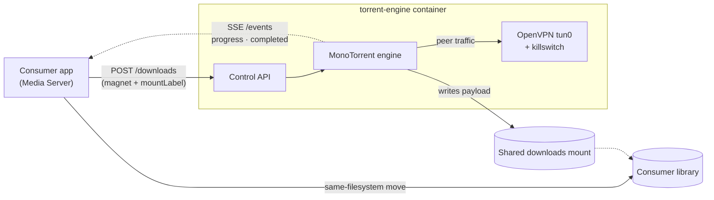
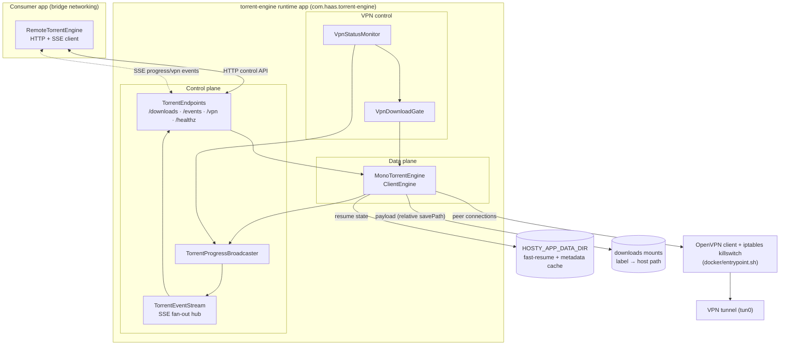

# Torrent Engine Documentation

## Overview

Torrent Engine is a standalone [Hosty](https://github.com/alex-de-haas/docker-host)
runtime app: a BitTorrent engine (MonoTorrent) that runs **inside an OpenVPN
tunnel** behind a default-deny killswitch and exposes an HTTP/SSE **control API**
for other Hosty apps to drive downloads over a cross-app dependency. Unlike its
sibling [Media Server](https://github.com/alex-de-haas/media-server) — whose docs
are a forward-looking plan — this documentation describes an **implemented** app
(`manifest.json` `version` `0.4.0`); each feature doc is marked `Status:
Implemented` and reflects the code in `src/TorrentEngine.Api/`.

The defining goal is **network isolation for torrent traffic only**. Running the
engine in its own container means just this container's peer traffic egresses
through the VPN, while the consuming app (and its own HTTP surface) stays on the
direct connection. This solves two problems at once:

1. **VPN-only-for-torrent.** Routing an entire media app through a VPN would drag
   its whole HTTP surface with it. Isolating the engine in its own network
   namespace confines the VPN policy to torrent traffic.
2. **Throughput + exposure under docker.** BitTorrent's per-peer connection churn
   collapses under the docker bridge NAT. Tunnelling every peer connection through
   a single VPN flow sidesteps that throttle without giving the engine host
   networking (which would expose its control port and break portability).

The originating design note lives in the consumer repo:
[`media-server/docs/ideas/torrent-engine-app.md`](https://github.com/alex-de-haas/media-server/blob/main/docs/ideas/torrent-engine-app.md).

## Primary Use Case

## High-Level Architecture

## Technology Stack

Engine (`engine` service):

- .NET 10 ASP.NET Core Minimal API, published as a **Native AOT** self-contained
  binary (no managed runtime) — JSON via a source-generated serializer context and
  minimal-API delegates via the Request Delegate Generator.
- [MonoTorrent](https://github.com/alan-turing-institute/MonoTorrent) 3.0.2 for the
  BitTorrent client (DHT/PEX/LSD, protocol encryption, fast-resume/metadata cache),
  run as a hosted service.
- Server-Sent Events for real-time progress and state transitions (server→client
  only); an in-memory fan-out hub with per-subscriber bounded channels.
- OpenTelemetry (traces, metrics, logs over OTLP/HTTP), opt-in and entirely driven
  by the `OTEL_*` environment Hosty Core injects.

Runtime and delivery:

- Hosty runtime app manifest (`manifest.json`, `schemaVersion: "app.0.1"`), a
  single `docker` runtime profile (`defaultRuntime: docker`).
- A `runtime-deps` container image carrying OpenVPN + iptables, with an entrypoint
  that brings up the tunnel behind a killswitch before launching the API. Requires
  `NET_ADMIN` and `/dev/net/tun`, granted through the manifest.
- GitHub Actions for build/test (`ci.yml`) and multi-arch image publishing to GHCR
  (`publish.yml`).

## Ideas

No idea documents yet. The originating proposal (now realized) is
`docs/ideas/torrent-engine-app.md` in the Media Server repo.

## Features

- [Control API](features/control-api.md) — HTTP endpoints, request/response
  contracts, the per-torrent snapshot, and the SSE event stream.
- [Torrent engine](features/torrent-engine.md) — the MonoTorrent `ClientEngine`
  wrapper: settings, lifecycle, state→event mapping, and snapshot derivation.
- [VPN isolation and killswitch](features/vpn-isolation.md) — OpenVPN bring-up, the
  iptables killswitch, DNS routing, the status monitor, and the download gate.
- [Downloads mounts and zero-copy hand-off](features/downloads-mounts.md) — labelled
  multi-mount routing, `savePath` resolution, and traversal safety.
- [Hosty runtime app](features/hosty-runtime-app.md) — the manifest, runtime
  profile, capabilities/devices, settings, app data, and telemetry.
- [Consumer integration](features/consumer-integration.md) — how a consumer declares
  the dependency, discovers the engine, and tolerates its absence.
- [Configuration](features/configuration.md) — the full environment-variable
  reference.
- [Build and deployment](features/build-and-deployment.md) — the Native AOT
  Dockerfile, the entrypoint, CI/publish, and local development.

## Testing Expectations

Backend unit tests must use xUnit; dependencies are mocked with
[Imposter](https://www.nuget.org/packages/Imposter). Endpoint tests host
`MapTorrentEndpoints` on an in-memory `TestServer`
(`Microsoft.AspNetCore.TestHost`). New features should include corresponding unit
tests scoped to the behavior they introduce. VPN/killswitch behavior that depends
on real container capabilities (leak tests on tunnel drop) is validated at the
runtime level, not by unit tests. Feature-specific testing requirements are
documented in the relevant feature files.

## Roadmap

- **Shipped.** VPN-isolated MonoTorrent engine, HTTP/SSE control API, richer
  per-torrent stats (peers/pieces/ETA), multiple labelled downloads mounts, VPN
  status monitor + download gate, OTLP telemetry, Native AOT image, and Media
  Server consumer wiring (`RemoteTorrentEngine`).
- **Killswitch hardening.** Leak-test the iptables rules in a real VPN environment
  (kill the tunnel; confirm no peer traffic egresses the bridge) — see
  [VPN isolation](features/vpn-isolation.md).
- **Cross-app auth/routing.** The `control` endpoint is non-public; reaching it
  across containers needs the planned shared cross-app docker network, and real
  multi-tenant use needs the Hosty app-identity token mechanism — see
  [Consumer integration](features/consumer-integration.md).
- **Multiple consumers (on demand).** The API boundary is deliberately clean, but
  multi-tenancy (per-consumer ownership, quotas, isolation) is deferred until a
  real second consumer exists (YAGNI).

## Non-Goals

- Multi-tenancy / per-consumer isolation until a second consumer exists.
- Content indexing, search, or a torrent discovery UI (the engine is driven by a
  consumer, not by end users).
- Media organization, identification, metadata, or streaming — those belong to the
  consumer (Media Server), not the engine.
- Persisting download progress or history — snapshots are live and in-memory. What
  *is* persisted (under the app data dir) is the torrent roster plus MonoTorrent
  fast-resume/metadata, so the downloads themselves survive a restart: on shutdown the
  engine writes its state, and on startup it restores the roster and resumes each
  torrent (a metadata-less magnet keeps waiting for metadata).
- Bundling a VPN provider — the operator supplies their own `.ovpn` config.

## Summary

Torrent Engine is a focused, VPN-isolated BitTorrent engine exposed as a Hosty
runtime app. Its center of gravity is the split between a **control plane** (an
HTTP/SSE API a consumer drives) and a **data plane** (a MonoTorrent client whose
peer traffic can only leave through an OpenVPN tunnel guarded by a killswitch).
A consumer adds a download against a labelled shared mount, watches progress over
SSE, and performs a zero-copy same-filesystem move when it completes — while the
engine keeps torrent traffic off the direct connection.

<!-- docs-index:begin -->

_Generated by `scripts/docs-index.mjs --fix` — do not edit this block by hand._

### Features

_None yet._

### Legacy documents (pre-migration)

- [features/build-and-deployment](features/build-and-deployment.md) — Implemented
- [features/configuration](features/configuration.md) — Implemented
- [features/consumer-integration](features/consumer-integration.md) — Implemented
- [features/control-api](features/control-api.md) — Implemented
- [features/downloads-mounts](features/downloads-mounts.md) — Implemented
- [features/hosty-runtime-app](features/hosty-runtime-app.md) — Implemented
- [features/torrent-engine](features/torrent-engine.md) — Implemented
- [features/vpn-isolation](features/vpn-isolation.md) — Implemented

<!-- docs-index:end -->
