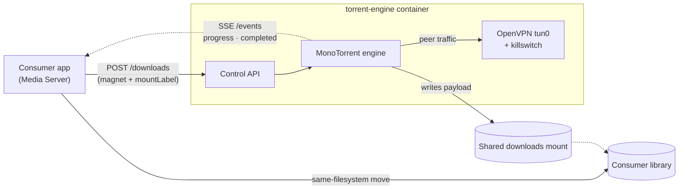
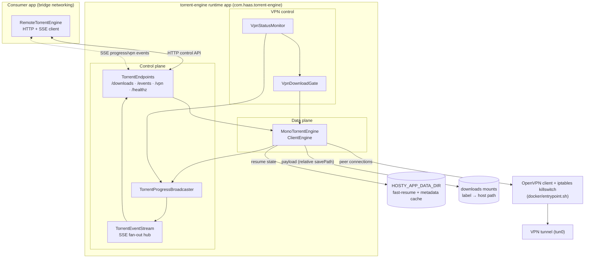

# Torrent Engine Documentation

## Overview

Torrent Engine is a standalone [Hosty](https://github.com/alex-de-haas/docker-host)
runtime app: a BitTorrent engine (MonoTorrent) that runs **inside an OpenVPN
tunnel** behind a default-deny killswitch and exposes an HTTP/SSE **control API**
for other Hosty apps to drive downloads over a cross-app dependency. Unlike its
sibling [Media Server](https://github.com/alex-de-haas/media-server) — whose docs
are a forward-looking plan — this documentation describes an **implemented** app;
each `feature.md` reflects the code in `src/TorrentEngine.Api/` as it stands, and
anything still unbuilt lives in that feature's `plan.md` (see the index below).

The defining goal is **network isolation for torrent traffic only**. Running the
engine in its own container means just this container's peer traffic egresses
through the VPN, while the consuming app (and its own HTTP surface) stays on the
direct connection. This solves two problems at once:

1. **VPN-only-for-torrent.** Routing an entire media app through a VPN would drag
   its whole HTTP surface with it. Isolating the engine in its own network
   namespace confines the VPN policy to torrent traffic.
2. **Throughput + exposure under docker.** BitTorrent's per-peer connection churn
   collapses under the docker bridge NAT. Tunnelling every peer connection through
   a single VPN flow sidesteps that throttle without giving the engine host
   networking (which would expose its control port and break portability).

Media Server is the reference consumer; its side of the integration is described in
[`media-server/docs/features/torrents-and-organizer/feature.md`](https://github.com/alex-de-haas/media-server/blob/main/docs/features/torrents-and-organizer/feature.md).

## Primary Use Case

```mermaid
flowchart LR
  C["Consumer app<br/>(Media Server)"] -->|"POST /downloads<br/>(magnet + mountLabel)"| API
  subgraph ENGINE["torrent-engine container"]
    API["Control API"] --> ENG["MonoTorrent engine"]
    ENG -->|peer traffic| VPN["OpenVPN tun0<br/>+ killswitch"]
  end
  ENG -->|writes payload| MNT[("Shared downloads mount")]
  ENG -.->|"SSE /events<br/>progress · completed"| C
  C -->|"same-filesystem move"| LIB[("Consumer library")]
  MNT -.-> LIB
```

## High-Level Architecture

```mermaid
flowchart TB
  subgraph Consumer["Consumer app (bridge networking)"]
    RTE["RemoteTorrentEngine<br/>HTTP + SSE client"]
  end
  subgraph App["torrent-engine runtime app (com.haas.torrent-engine)"]
    subgraph Api["Control plane"]
      EP["TorrentEndpoints<br/>/downloads · /events · /vpn · /healthz"]
      STREAM["TorrentEventStream<br/>SSE fan-out hub"]
      BCAST["TorrentProgressBroadcaster"]
    end
    subgraph Engine["Data plane"]
      MTE["MonoTorrentEngine<br/>ClientEngine"]
    end
    subgraph VpnSub["VPN control"]
      MON["VpnStatusMonitor"]
      GATE["VpnDownloadGate"]
    end
  end
  KS["OpenVPN client + iptables killswitch<br/>(docker/entrypoint.sh)"]
  TENV["VPN tunnel (tun0)"]
  DATA[("HOSTY_APP_DATA_DIR<br/>fast-resume + metadata cache")]
  DL[("downloads mounts<br/>label → host path")]

  RTE <-->|"HTTP control API"| EP
  RTE <-.->|"SSE progress/vpn events"| EP
  EP --> MTE
  MTE --> BCAST --> STREAM --> EP
  MON --> BCAST
  MON --> GATE --> MTE
  MTE -->|"resume state"| DATA
  MTE -->|"payload (relative savePath)"| DL
  MTE -->|"peer connections"| KS --> TENV
```

## Technology Stack

Engine (`engine` service):

- .NET 10 ASP.NET Core Minimal API, published as a **Native AOT** self-contained
  binary (no managed runtime) — JSON via a source-generated serializer context and
  minimal-API delegates via the Request Delegate Generator.
- [MonoTorrent](https://github.com/alan-turing-institute/MonoTorrent) 3.0.2 for the
  BitTorrent client (DHT/PEX/LSD, protocol encryption, fast-resume/metadata cache),
  run as a hosted service.
- Server-Sent Events for real-time progress and state transitions (server→client
  only); an in-memory fan-out hub with per-subscriber bounded channels.
- OpenTelemetry (traces, metrics, logs over OTLP/HTTP), opt-in and entirely driven
  by the `OTEL_*` environment Hosty Core injects.

Runtime and delivery:

- Hosty runtime app manifest (`manifest.json`, `schemaVersion: "app.0.1"`), a
  single `docker` runtime profile (`defaultRuntime: docker`).
- A `runtime-deps` container image carrying OpenVPN + iptables, with an entrypoint
  that brings up the tunnel behind a killswitch before launching the API. Requires
  `NET_ADMIN` and `/dev/net/tun`, granted through the manifest.
- GitHub Actions for build/test (`ci.yml`) and multi-arch image publishing to GHCR
  (`publish.yml`).

## Documents

Every feature folder is listed in the generated index below with its summary and, where it has a
plan, the plan's status, deliverable progress and last update. The list is generated from each
document's frontmatter; the format and the rules for writing documents are in the Documentation
section of [AGENTS.md](../AGENTS.md).

## Testing Expectations

Backend unit tests must use xUnit; dependencies are mocked with
[Imposter](https://www.nuget.org/packages/Imposter). Endpoint tests host
`MapTorrentEndpoints` on an in-memory `TestServer`
(`Microsoft.AspNetCore.TestHost`). New features should include corresponding unit
tests scoped to the behavior they introduce. VPN/killswitch behavior that depends
on real container capabilities (leak tests on tunnel drop) is validated at the
runtime level, not by unit tests. Feature-specific testing requirements are
documented in the relevant feature files.

## Roadmap

- **Shipped.** VPN-isolated MonoTorrent engine, HTTP/SSE control API, richer
  per-torrent stats (peers/pieces/ETA), multiple labelled downloads mounts, VPN
  status monitor + download gate, OTLP telemetry, Native AOT image, Media
  Server consumer wiring (`RemoteTorrentEngine`), and file-based OpenVPN profiles
  with runtime switching.
- **Killswitch hardening.** Leak-test the iptables rules in a real VPN environment
  (kill the tunnel; confirm no peer traffic egresses the bridge) — tracked in
  [VPN isolation plan](features/vpn-isolation/plan.md).
- **Cross-app auth/routing.** The `control` endpoint is non-public; reaching it
  across containers needs the planned shared cross-app docker network, and real
  multi-tenant use needs the Hosty app-identity token mechanism — see
  [Consumer integration](features/consumer-integration/feature.md).
- **Multiple consumers (on demand).** The API boundary is deliberately clean, but
  multi-tenancy (per-consumer ownership, quotas, isolation) is deferred until a
  real second consumer exists (YAGNI).

## Non-Goals

- Multi-tenancy / per-consumer isolation until a second consumer exists.
- Content indexing, search, or a torrent discovery UI (the engine is driven by a
  consumer, not by end users).
- Media organization, identification, metadata, or streaming — those belong to the
  consumer (Media Server), not the engine.
- Persisting download progress or history — snapshots are live and in-memory. What
  *is* persisted (under the app data dir) is the torrent roster plus MonoTorrent
  fast-resume/metadata, so the downloads themselves survive a restart: on shutdown the
  engine writes its state, and on startup it restores the roster and resumes each
  torrent (a metadata-less magnet keeps waiting for metadata).
- Bundling a VPN provider — the operator supplies their own `.ovpn` profiles.

## Summary

Torrent Engine is a focused, VPN-isolated BitTorrent engine exposed as a Hosty
runtime app. Its center of gravity is the split between a **control plane** (an
HTTP/SSE API a consumer drives) and a **data plane** (a MonoTorrent client whose
peer traffic can only leave through an OpenVPN tunnel guarded by a killswitch).
A consumer adds a download against a labelled shared mount, watches progress over
SSE, and performs a zero-copy same-filesystem move when it completes — while the
engine keeps torrent traffic off the direct connection.

<!-- docs-index:begin -->

_Generated by `scripts/docs-index.mjs --fix` — do not edit this block by hand._

### Features

Plans: 2 In Progress.

- [Build and Deployment](features/build-and-deployment/feature.md) — The Native AOT container image, its entrypoint, CI and multi-arch publishing, and local development.
- [Configuration](features/configuration/feature.md) — The environment-variable reference for the engine, the VPN monitor and the tunnel entrypoint.
- [Consumer Integration](features/consumer-integration/feature.md) — How a consumer app declares the engine as a dependency, discovers it, shares downloads mounts and tolerates its absence.
- [Control API](features/control-api/feature.md) — The HTTP control API and SSE event stream through which consumers drive downloads and the VPN.
- [DHT Status](features/dht/feature.md) — DHT health reporting that separates a DHT that is enabled but not working from one that is off or idle.
- [Docker Development Runtime](features/docker-development/feature.md) — The dev profile runs editable source with dotnet watch inside the VPN-isolated development container. · [plan](features/docker-development/plan.md): In Progress, 6/7, updated 2026-09-17
- [Downloads Mounts and Zero-Copy Hand-off](features/downloads-mounts/feature.md) — Labelled downloads mounts route each download onto the consumer's filesystem so the hand-off is a zero-copy move.
- [Hosty Runtime App](features/hosty-runtime-app/feature.md) — The Hosty manifest, runtime profiles, capabilities and devices, settings, app data and telemetry.
- [Torrent Engine](features/torrent-engine/feature.md) — The MonoTorrent ClientEngine wrapper, its settings, lifecycle, event mapping and snapshot derivation.
- [VPN Isolation and Killswitch](features/vpn-isolation/feature.md) — OpenVPN bring-up behind a default-deny iptables killswitch, DNS routing, the status monitor and the download gate. · [plan](features/vpn-isolation/plan.md): In Progress, 1/4, updated 2026-09-17
- [VPN Profiles](features/vpn-profiles/feature.md) — A folder of OpenVPN profiles with one active profile, switchable at runtime without recreating the container.

<!-- docs-index:end -->
